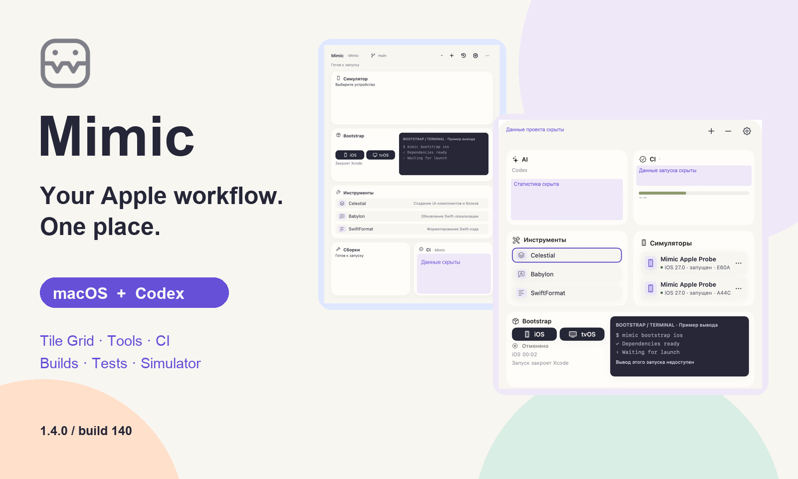

<!-- Created by Василий Маслов on 06.10.2026. -->

# Mimic

**Apple development at hand — on macOS and inside Codex.**

[Русский](README.md) · [English](README.en.md)

  

[**Download Mimic 1.4.0**](https://github.com/Stubbs221/Mimic/releases/tag/v1.4.0) · [**Get started**](docs/MimicSetup.md) · [What's new](CHANGELOG.md)

> [!TIP]
> **Mimic 1.4.0 · build 140 · October 8, 2026.** Developer ID signed and Apple notarized. Install the ready-to-use app or update from 1.3.1 in **Настройки → Основные**.

Mimic brings your team's familiar workflows together: project preparation, tools, builds, selected tests and CI. Open it from the menu bar or work beside your agent in Codex. **One executor, a shared queue and history, and a separate project context for each chat.**

## Explore and share

Three illustrated documents in Russian, using the Mimic palette. **View PDFs on GitHub or download the HTML and open it in a browser.** Styles, screenshots and image zoom work offline.

| Document | PDF | HTML |
| --- | --- | --- |
| **A 2–3 minute introduction** — the essentials | [View](docs/releases/1.4.0/quick-preview.pdf) | [Download](https://github.com/Stubbs221/Mimic/raw/refs/heads/main/docs/releases/1.4.0/quick-preview.html) |
| **Full overview** — features, diagrams and security | [View](docs/releases/1.4.0/overview.pdf) | [Download](https://github.com/Stubbs221/Mimic/raw/refs/heads/main/docs/releases/1.4.0/overview.html) |
| **Guide** — installation, setup and everyday use | [View](docs/releases/1.4.0/guide.pdf) | [Download](https://github.com/Stubbs221/Mimic/raw/refs/heads/main/docs/releases/1.4.0/guide.html) |

[**All HTML in one ZIP**](https://github.com/Stubbs221/Mimic/raw/refs/heads/main/docs/releases/1.4.0/Mimic-1.4.0-HTML.zip) — extract the three files together for navigation between documents. [About the materials](docs/releases/1.4.0/README.md).

## Less switching. More doing.

| 🧩 Your panel | 🛠 Your team's tools | 🚦 Checks at hand |
| --- | --- | --- |
| **Tile Grid** — tile order, sizing and independent macOS/Codex layouts. Light and dark themes, with the previous interface still available. | **Celestial, Babylon, Protobuf, SwiftFormat** and cleanup tools. Up to three shared favorites; Celestial previews the files first. | **Builds and selected tests** on a specific Simulator. Jenkins/GitLab: UI tests, Quality Gates, Beta, status and results. |
| **Bootstrap and terminals** — a sequential queue, stages, progress, cancellation and history. | **Branches and rebase** — optional rebase onto develop, a backup of local edits and conflict handoff to Codex. | **AI limits and statistics** — remaining capacity, reset times and usage trends for supported tools. |

## The real interface

<table>
<tr><th>Tools catalog</th><th>Simulator inside Codex</th></tr>
<tr><td align="center"></td><td align="center"></td></tr>
</table>

Screen, taps, swipes, typing, Home and rotation stay inside the panel. Image and input sources are independent: MCP video or snapshots, continuous HID gestures or Apple MCP. Auto mode uses snapshots when video is unavailable. **The screen requires Xcode 27+** and available native Apple tools. WSS needs a separately configured trusted endpoint. [Connect a Simulator](docs/CodexPlugin.md#экран-симулятора).

Real UI captures: macOS is the installed 1.4.0/140; Codex shows development Tile Grid before the final build. The device runs the Mimic test app. Working data is covered with opaque pixel redactions; favorite-order arrows belong to the app. [Image notes](docs/images/README.md).

## Get started

1. Download `MimicSetup-<version>.zip` from [GitHub Releases](https://github.com/Stubbs221/Mimic/releases/latest) and extract it.
2. Run `setup-mimic.command` or move `Mimic.app` into Applications.
3. Choose a Git checkout, import your team's trusted `.mimicprofile`, and set Xcode, workspace/project and the Apple target.
4. Connect Codex and CI in settings if needed. Enter credentials in the native forms.

> [!IMPORTANT]
> **The team profile is supplied separately.** A compatible `.mimicprofile` is required to open the workspace. Obtain it from your team: private commands, adapters and addresses are not bundled. Source examples are test fixtures.

## Private configuration. Explicit actions.

- **Keychain** stores CI credentials; you do not need to enter them in chat.
- **The agent catalog** exposes allowed actions and parameters. It omits commands, adapters and service addresses; explicitly requested diagnostics may be sent to the agent.
- **The panel's private channel** delivers the Simulator screen; an explicit agent observation can return a screenshot and device hierarchy.
- **A trusted profile** contains executable adapters. Check its source and review logs before sharing: known-secret redaction cannot guarantee removal of every sensitive value.

[Profiles](docs/Profiles.md) · [Codex and access boundaries](docs/CodexPlugin.md) · [Security](SECURITY.md)

## Install once. Update from the app.

Mimic checks its signed feed hourly. Manual checking and the automatic-update switch are in **Настройки → Основные**. Installation waits for local work, creates a backup and preserves profiles, settings and history. The Codex plugin refreshes when a new build starts; reopen an existing panel if needed.

**Apple Silicon · macOS 14+ · Russian interface.** Intel and runtime on macOS 14 are not qualified. Work requires Xcode and your profile's tools; the panel needs local Codex with plugins and MCP Apps.

---

Detailed guides are currently in Russian.

[Installation](docs/MimicSetup.md) · [Codex](docs/CodexPlugin.md) · [Troubleshooting](docs/Troubleshooting.md) · [Report an issue](https://github.com/Stubbs221/Mimic/issues)

[Contributing](CONTRIBUTING.md) · [MIT](LICENSE) · [Component licenses](ThirdPartyNotices/README.md)

Author: Василий Маслов.
