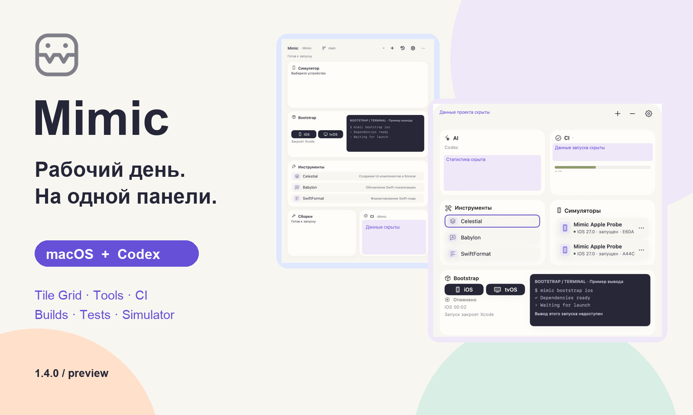
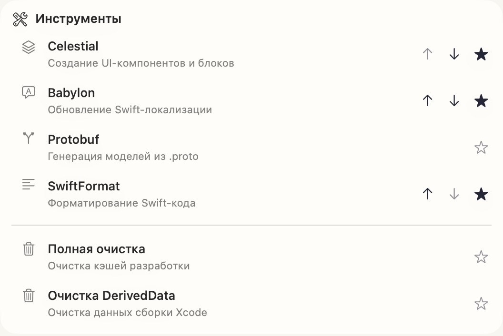
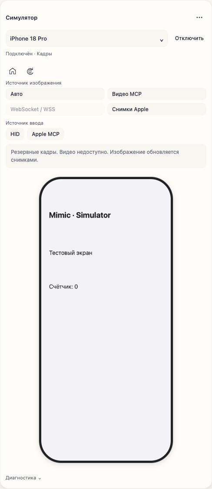

<!-- Created by Василий Маслов on 01.10.2026. -->

# Mimic

**Apple-разработка под рукой — в macOS и внутри Codex.**

[Русский](README.md) · [English](README.en.md)

  

[**Скачать Mimic 1.4.0**](https://github.com/Stubbs221/Mimic/releases/tag/v1.4.0) · [**Установка за несколько шагов**](docs/MimicSetup.md) · [Что нового](CHANGELOG.md)

> [!TIP]
> **Mimic 1.4.0 · build 140 · 8 октября 2026.** Подписан Developer ID и прошёл нотарификацию Apple. Установи готовое приложение или обновись с 1.3.1 через **Настройки → Основные**.

Mimic собирает привычные сценарии команды в одном месте: подготовку проекта, инструменты, сборки, выбранные тесты и CI. Открывай панель из строки меню или работай рядом с агентом в Codex. **Один исполнитель, общая очередь и история; у каждого чата свой контекст проекта.**

## Посмотреть и поделиться

Три иллюстрированных документа на русском, в палитре Mimic. **PDF можно посмотреть на GitHub; HTML скачай и открой в браузере** — стили, скриншоты и увеличение изображений работают без интернета.

| Документ | PDF | HTML |
| --- | --- | --- |
| **Знакомство за 2–3 минуты** — главное о Mimic | [Посмотреть](docs/releases/1.4.0/quick-preview.pdf) | [Скачать](https://github.com/Stubbs221/Mimic/raw/refs/heads/main/docs/releases/1.4.0/quick-preview.html) |
| **Полный обзор** — возможности, схемы и безопасность | [Посмотреть](docs/releases/1.4.0/overview.pdf) | [Скачать](https://github.com/Stubbs221/Mimic/raw/refs/heads/main/docs/releases/1.4.0/overview.html) |
| **Инструкция** — установка, настройка и ежедневная работа | [Посмотреть](docs/releases/1.4.0/guide.pdf) | [Скачать](https://github.com/Stubbs221/Mimic/raw/refs/heads/main/docs/releases/1.4.0/guide.html) |

[**Все HTML одним архивом**](https://github.com/Stubbs221/Mimic/raw/refs/heads/main/docs/releases/1.4.0/Mimic-1.4.0-HTML.zip) — распакуй три файла рядом для переходов между документами. [О материалах](docs/releases/1.4.0/README.md).

## Меньше переключений. Больше дела.

| 🧩 Панель под тебя | 🛠 Инструменты команды | 🚦 Проверки рядом |
| --- | --- | --- |
| **Tile Grid** — порядок, размеры плиток и независимые раскладки macOS/Codex. Светлая и тёмная темы; можно вернуться к прежнему интерфейсу. | **Celestial, Babylon, Protobuf, SwiftFormat** и очистки. До трёх общих избранных; Celestial сначала показывает будущие файлы. | **Сборки и выбранные тесты** на конкретном Simulator. Jenkins/GitLab: UI-тесты, Quality Gates, Beta, статусы и результаты. |
| **Bootstrap и терминалы** — последовательная очередь, этапы, прогресс, отмена и история. | **Ветки и rebase** — опциональный rebase на develop, резерв локальных изменений и передача конфликтов в Codex. | **AI-лимиты и статистика** — остаток, сброс и тренд использования поддерживаемых инструментов. |

## Настоящий интерфейс

<table>
<tr><th>Каталог инструментов</th><th>Simulator внутри Codex</th></tr>
<tr><td align="center"></td><td align="center"></td></tr>
</table>

Экран, tap, swipe, ввод текста, Home и поворот — внутри панели. Источники изображения и ввода выбираются независимо: видео MCP или снимки, непрерывные HID-жесты или Apple MCP. «Авто» использует снимки, если видео недоступно. **Для экрана нужен Xcode 27+** и доступные нативные инструменты Apple. WSS требует отдельного доверенного endpoint. [Как подключить](docs/CodexPlugin.md#экран-симулятора).

Скриншоты настоящего UI: macOS — установленная 1.4.0/140; Codex — development-интерфейс Tile Grid до финальной сборки. На устройстве открыта тестовая «Проверка Mimic». Рабочие данные скрыты непрозрачно в пикселях; стрелки порядка избранного — элементы приложения. [Об изображениях](docs/images/README.md).

## Первый запуск

1. Скачай `MimicSetup-<version>.zip` из [GitHub Releases](https://github.com/Stubbs221/Mimic/releases/latest) и распакуй.
2. Запусти `setup-mimic.command` или перенеси `Mimic.app` в Applications.
3. Выбери Git checkout, импортируй доверенный `.mimicprofile` команды, укажи Xcode и workspace/project с Apple target.
4. По необходимости подключи Codex и CI через настройки. Credentials вводятся в нативных формах.

> [!IMPORTANT]
> **Профиль команды поставляется отдельно.** Без совместимого `.mimicprofile` рабочая панель не откроется. Получи его у команды: приватные команды, адаптеры и адреса не входят в приложение. Примеры в исходниках — тестовые фикстуры.

## Приватная конфигурация. Явные действия.

- **Keychain** хранит учётные данные CI; в чат их вводить не нужно.
- **Каталог агента** содержит разрешённые действия и параметры. Команды, адаптеры и адреса сервисов в него не входят; явно запрошенная диагностика может передаваться агенту.
- **Приватный канал панели** доставляет экран Simulator; явный запрос наблюдения агента может вернуть снимок и иерархию устройства.
- **Доверенный профиль** содержит исполняемые адаптеры. Проверяй источник профиля и логи перед пересылкой: очистка известных форматов секретов не гарантирует удаления любых чувствительных данных.

[Профили](docs/Profiles.md) · [Границы доступа и Codex](docs/CodexPlugin.md) · [Безопасность](SECURITY.md)

## Установил один раз — обновляйся из приложения

Mimic проверяет подписанную ленту раз в час. Ручная проверка и отключение автообновлений доступны в **Настройки → Основные**. Установка ждёт локальную работу, создаёт резервную копию и сохраняет профиль, настройки и историю. Плагин Codex обновляется при запуске новой сборки; открытую панель может понадобиться открыть заново.

**Apple Silicon · macOS 14+ · русский интерфейс.** Runtime на macOS 14 и Intel пока не квалифицирован. Для работы нужны Xcode и инструменты из профиля; для панели — локальный Codex с поддержкой плагинов и MCP Apps.

---

[Инструкция](docs/MimicSetup.md) · [Codex](docs/CodexPlugin.md) · [Частые проблемы](docs/Troubleshooting.md) · [Сообщить об ошибке](https://github.com/Stubbs221/Mimic/issues)

[Участие в разработке](CONTRIBUTING.md) · [MIT](LICENSE) · [Лицензии компонентов](ThirdPartyNotices/README.md)

Автор: Василий Маслов.
