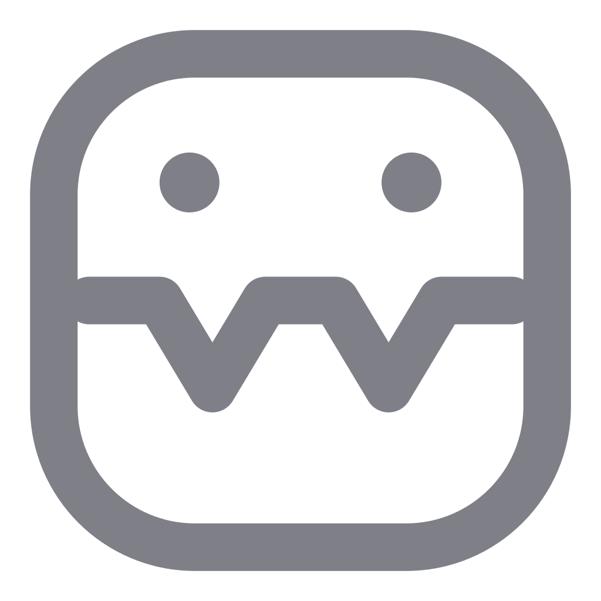
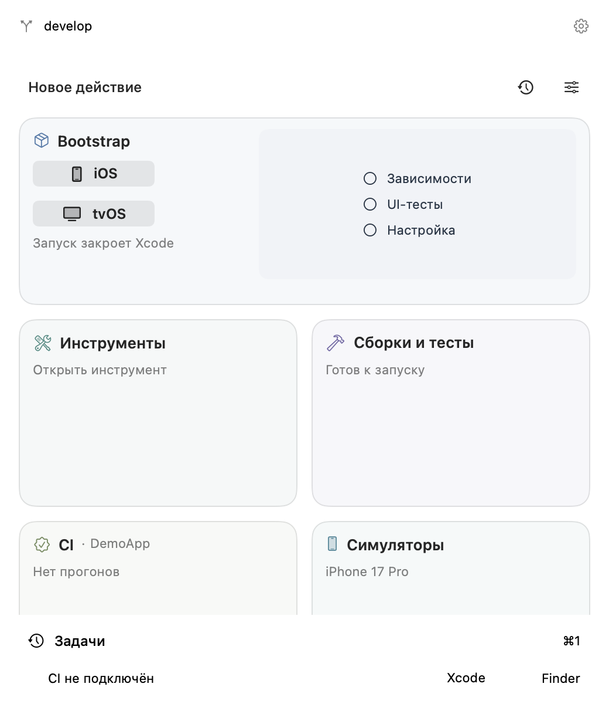
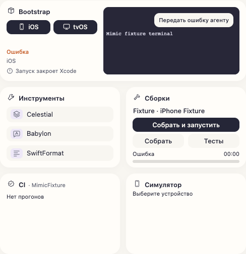
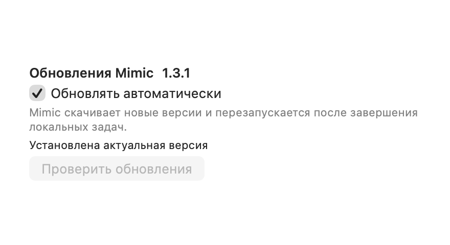

<!-- Created by Василий Маслов on 01.10.2026. -->
# Mimic

Русский · [English](README.en.md)

**Apple-разработка под рукой — в строке меню macOS и внутри Codex.**

Mimic объединяет локальные задачи, терминалы, сборки Simulator, выбранные тесты и наблюдение CI. Запускайте привычные сценарии команды через профиль и следите за результатом в одном месте.

[Скачать Mimic](https://github.com/Stubbs221/Mimic/releases/latest) · [Установка](docs/MimicSetup.md) · [Сообщить о проблеме](https://github.com/Stubbs221/Mimic/issues)

## Возможности

- Подготовка проекта, утилиты и генерация файлов с предпросмотром.
- Общая последовательная очередь локальных задач: прогресс, отмена, история и терминал.
- Сборки и выбранные тесты на конкретном iOS/tvOS Simulator.
- Наблюдение Jenkins/GitLab и действия, настроенные профилем команды.
- Панель задач внутри Codex с отдельным контекстом каждого чата.
- Лимиты поддерживаемых AI-инструментов и история использования.
- Автообновления: загрузка новой версии и установка после завершения локальной работы.

## Как выглядит

Главная панель в строке меню:

Панель для Codex:

Настройки обновлений:

Изображения показывают настоящий интерфейс с демонстрационными данными. Панель Codex снята в изолированном предпросмотре.

## Первый запуск

1. Скачайте `MimicSetup-1.3.1.zip` со страницы релизов и распакуйте архив.
2. Запустите `setup-mimic.command` либо перенесите `Mimic.app` в Applications.
3. Выберите Git-проект, импортируйте доверенный профиль команды, задайте Xcode и Apple target.
4. При необходимости подключите Codex и CI через настройки.

**Для открытия рабочей панели нужен совместимый `.mimicprofile`.** Получите его у команды: приватные команды, адаптеры и адреса сервисов поставляются отдельно. Приложение не включает готовый профиль для вашего проекта. Тестовые примеры в исходниках не являются рабочей конфигурацией команды. CI-подключения можно пропустить; учётные данные сохраняются в macOS Keychain.

## Совместимость и обновления

Выпуск предназначен для **Apple Silicon**, минимальная версия системы — **macOS 14**. Запуск на macOS 14 и Intel пока не проверен. Интерфейс приложения сейчас на русском. Для разработки нужны Xcode и инструменты, используемые вашим профилем; для Codex — локальная версия с поддержкой плагинов и MCP Apps.

После первой установки версии со встроенным обновлятором Mimic проверяет обновления раз в час. Ручная проверка и отключение автообновлений находятся в настройках. Установка ждёт завершения локальной работы; профиль, настройки и история сохраняются. Более старым версиям без обновлятора нужна одна ручная установка.

## Помощь

[Установка](docs/MimicSetup.md) · [Профили](docs/Profiles.md) · [Codex](docs/CodexPlugin.md) · [Устранение проблем](docs/Troubleshooting.md) · [Изменения](CHANGELOG.md)

[Участие в разработке](CONTRIBUTING.md) · [Безопасность](SECURITY.md)

Исходники распространяются по [MIT](LICENSE). Лицензии включённых компонентов — в [ThirdPartyNotices](ThirdPartyNotices/README.md).
